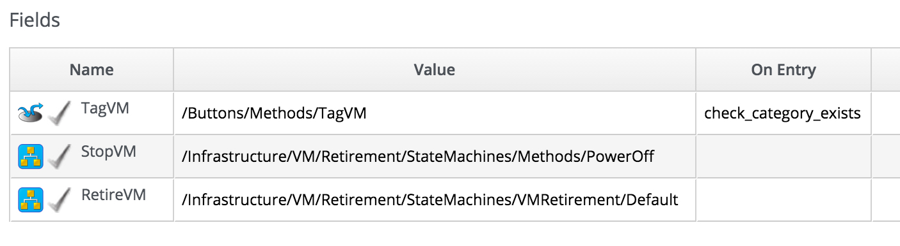
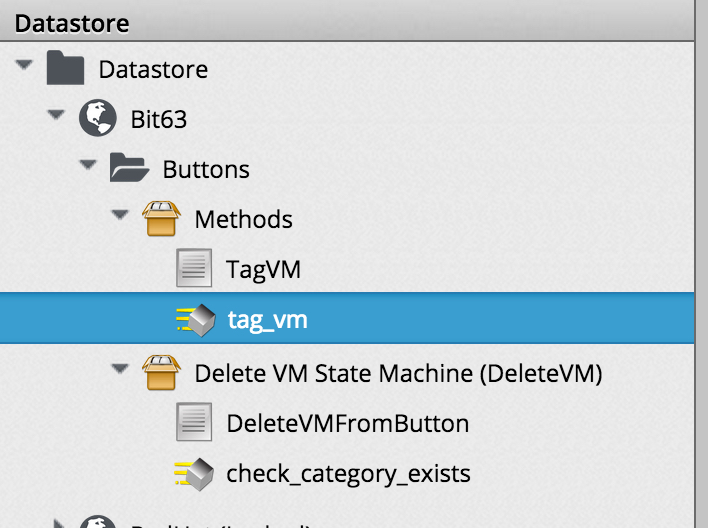
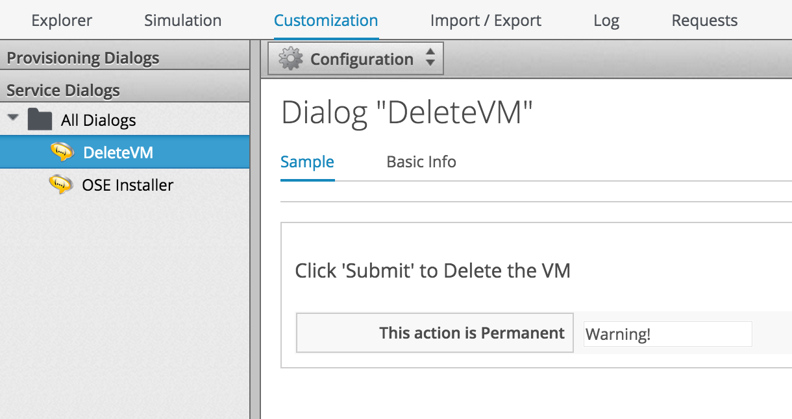
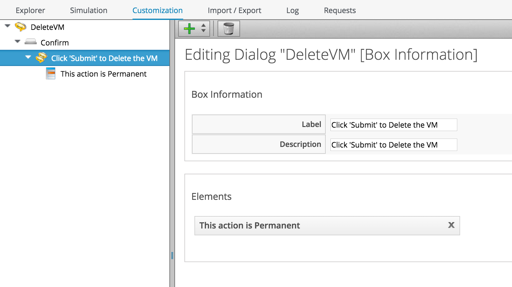
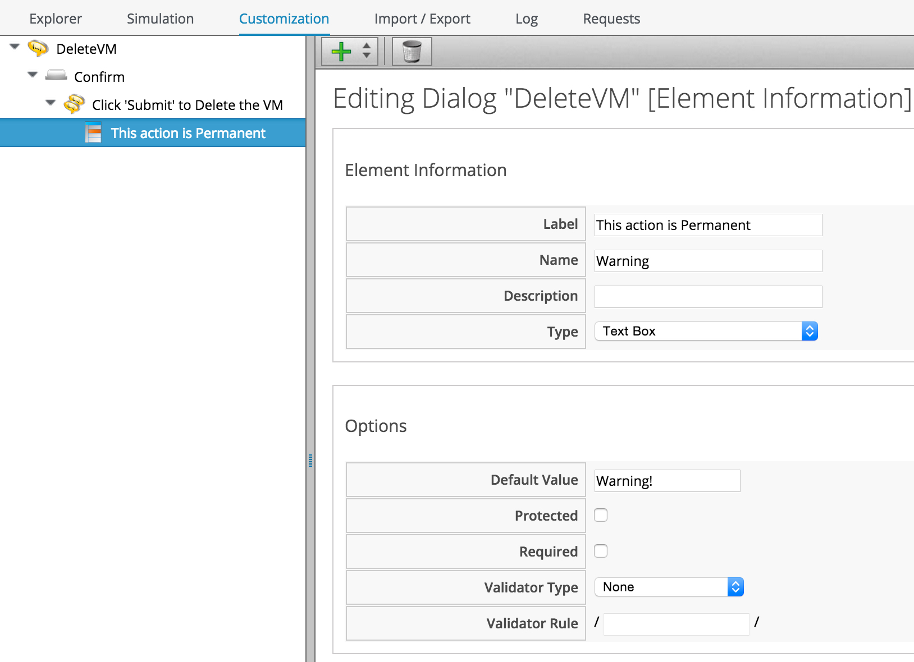
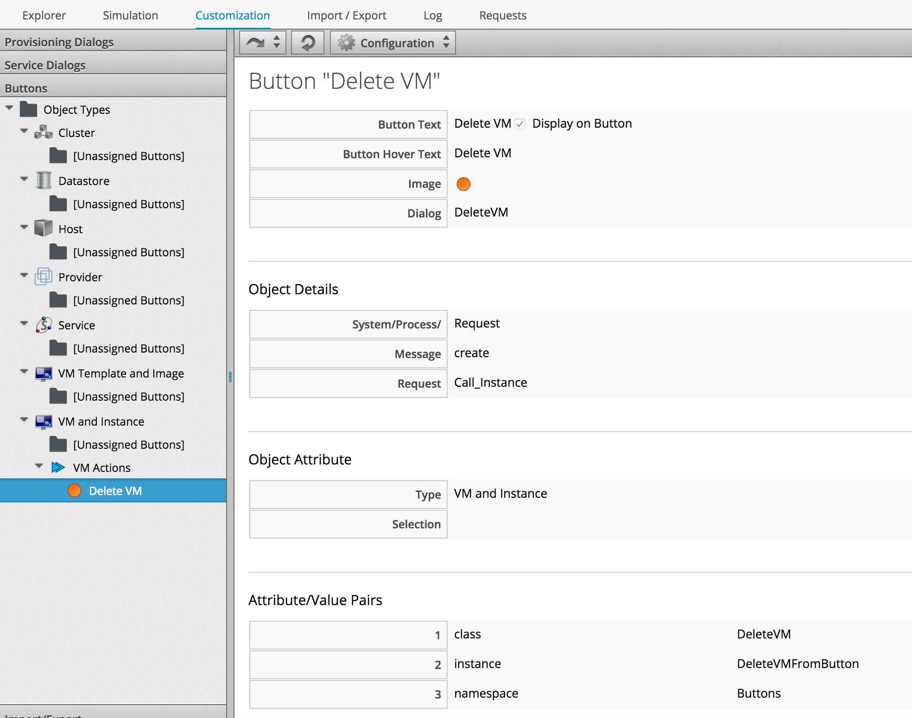
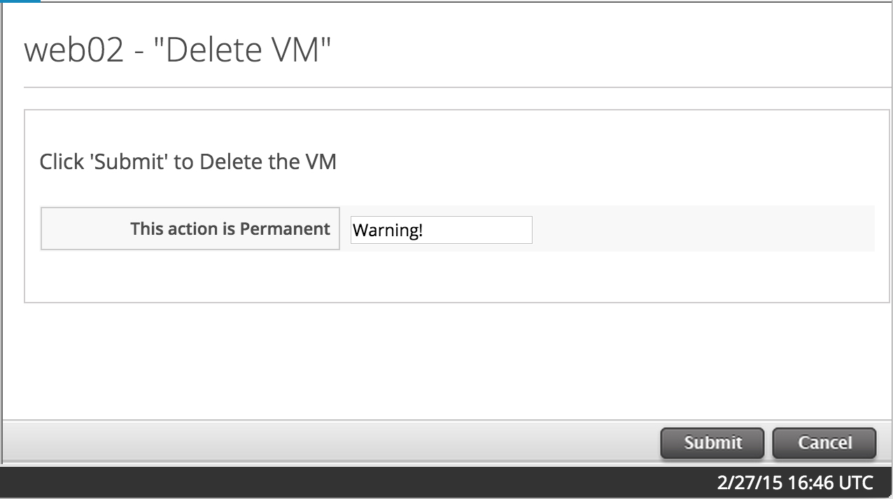

This is a simple state machine that can be called from a button to delete a VM. The VM is first tagged with 'lifecycle/retire_full', then
powered off (if necessary), retired, deleted from the underlying provider, and finally removed from the VMDB.





## Instruction for Use

The yaml export was taken from a domain called 'Export'. Copy the Buttons.yaml file to /var/www/miq/vmdb on your CloudForms or ManageIQ
appliance, then run the following command (in this example I'm importing it into my own domain called Bit63):

```
cd /var/www/miq/vmdb
script/rails runner script/rake evm:automate:import YAML_FILE=Buttons.yaml IMPORT_AS=Bit63 SYSTEM=false ENABLED=true DOMAIN=Export PREVIEW=false
```
You should see a new namespace appear containing the imported code, like so:





Now we need to create a service dialog and a button. The dialog is nice and simple. We'll call it "DeleteVM":





We'll give it a a tab called "Confirm", a Box called "Click 'Submit' to Delete the VM"...





...and a single text box element...





Now we create a Button Group called "VM Actions" for the _VM and Instance_ Object Type, and create a Button in this
group called "Delete VM". The Button calls the out-of-the-box Call_Instance method, with the arguments of namespace,
class and instance that point to our State Machine:





Finally we find a VM that we want to delete. Click on the VM details and the Button Group and Button should be visible:


Click "Delete VM", and we should see our dialog:





Click "Submit", and the VM should be powered off, retired, and deleted.

