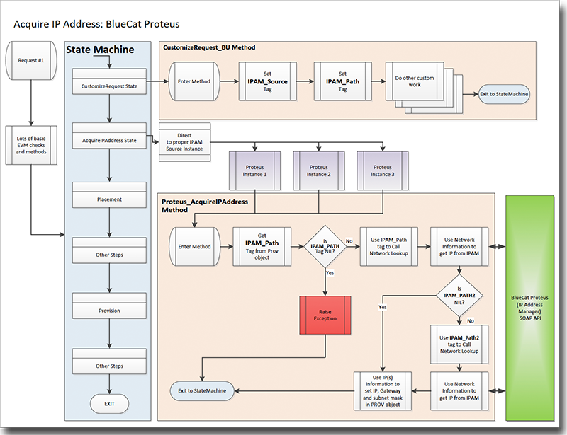
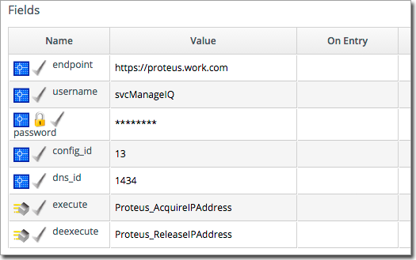
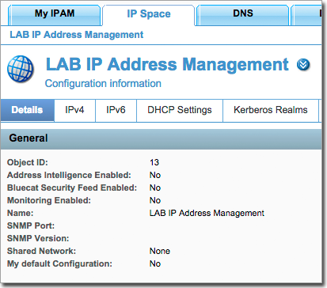
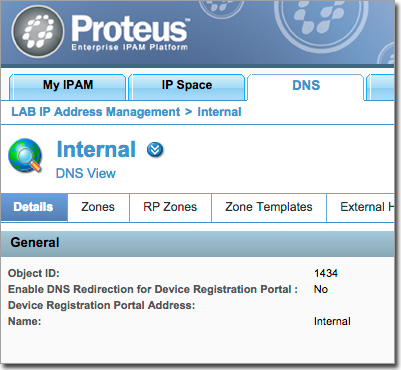
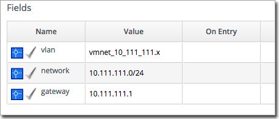
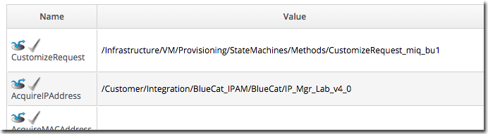
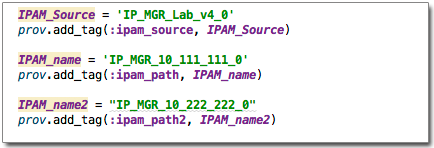
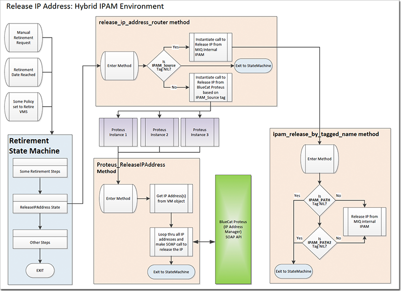

This extension allows for integration of the BlueCat Proteus IP Address Management (IPAM) system.  A robust IPAM 
system is a core component of push-button automation.   This extension was built to work in a hybrid network ecosystem 
where some IPs are manually assigned, some are assigned via ManageIQ's internal IPAM, and other IPs assigned via of 
multiple instances of BlueCat Proteus to include version 3.7x and 4.0.  This is used in CloudForms 3.1/ManageIQ 
Anand versions with vSphere as the provider.

#### Features Include:
- Request and release of IPs include support for dual NICs (UI and storage)
- Use of tags to specify the IPAM source should it be manual, MIQ internal or what instance of BlueCat
- Use of tags to acquire and release IPs from correct IPAM
- Code reuse by having all automation workflows call a single method to acquire or release an IP
- It will set the fully qualified hostname in the Proteus Host Name field (pushed to DNS) for the first NIC (UI) 
- It will set the hostname in the address field (informational field) for the 2nd NIC (storage)
- Release of IP if automation workflow fails after it has reserved an IP

## Overview of BlueCat Workflow

The follow image provides a basic overview of the BlueCat IPAM extension IP acquire workflow.   ManageIQ tags are used 
to define the IPAM Source (Proteus instance) and the IPAM Path or Paths (actual subnet) .  The tags are used to acquire 
an IP and these same tags are used during the retirement process.  The IPAM_Source, IPAM_Path, and IPAM_Path2 tags 
are set in the Customize request method   IPAM_Source tag defines which BlueCat Proteus instance to use.  This 
instance defines things such as the endpoint, login credentials, which methods to use for getting and releasing an IP 
as well as some IDs needed to navigate in Proteus.  The IPAM_Path tag is used to define the vLAN to be used with the 
primary NIC.  The optional IPAM_Path2 tag will define the network for a secondary NIC.  [View PDF](images/IPAM_Workflow.pdf)

## IPAM_Source Tag Information

The IPAM_Source tag defines which instance to call to acquire and release an IP via BlueCat Proteus.  The instance 
will include the SOAP API endpoint and login credentials.  The config_id and dns_id values are obtained from the 
Proteus UI and are discussed below.  The methods to acquire and release an IP are defined and can vary depending on 
the Proteus version.  The SOAP API changed from version 3.7 to version 4.0 and thus the code is different.

Proteus has the capability to define multiple configurations and ManageIQ SOAP calls need to pass the proper 
configuration ID to perform any actions.  See the BlueCat Proteus documentation for further details on configuration.  
To obtain the config_id value, log into the Proteus website and navigate to the IP Space=>Details.  Use object id found 
on this page to set the config_id in the IPAM_Source instance.   

Proteus has the capability to define multiple DNS configurations.  To obtain the dns_id value, log into the Proteus 
website and navigate to the proper DNS setting.  In this example it is DNS=>Internal=>Details.  Use object id found 
on this page to set the dns_id in the IPAM_Source instance.   

## IPAM_Path tag Information
The IPAM_Path and IPAM_Path2 tags are used to define which vLAN to use.  The vlan value is case sensitive and should 
match the name in vCenter (this has  not been tested other providers)

## Overview of file structure

The image below is from CloudForms v3.1 and it shows the basic file structure

## StateMachine setting

For your workflow instance in the StateMachine, define the CustomizeRequest and AcquireIPAddress values 
similar to the following

## Customize Request Examples

There are 3 possible tags that can drive the IPAM behavior.   The tag IPAM_Source is required to defined a BlueCat 
Proteus instance.  The IPAM_Path and IPAM_Path2 (optional) define which network(s) to acquire and release the IPs. 

## Release of IP Address(es)

The following image is a logical view of the process for the release of an IP address in a hybrid IPAM environment.  
The release IP Address Router method will route a request to the proper IPAM for release of the IP to the proper 
BlueCat Proteus instance or to the Internal MIQ IPAM system.  Within the MIQ IPAM release method, a code check is 
performed looking for the IPAM_Path tag.  If not found, we assume the request was a manually assigned IP and no 
further action is required.  [View PDF](images/IPAM_Workflow.pdf)

