This ManageIQ extension provides everything needed to implement a robust internal IP Address Management (IPAM) system.
An IPAM system is a core component of push-button automation.  This extension was built to work in a hybrid network 
ecosystem where some IPs are manually assigned, some are assigned via ManageIQ's internal IPAM, and other IPs assigned 
via a commercial IPAM system.  This can be used in CloudForms version 2.0+/ManageIQ Anand+ versions.

#### Features Include:
- Request and release of IPs include support for dual NICs (UI and storage)
- Use of tags to specify the IPAM source should it be manual, MIQ internal or commercial IPAM system
- Use of tags to acquire and release IPs from correct IPAM
- Code reuse by having all automation workflows call a single method to acquire or release an IP
- Ability to use the hostname from the IPAM or to define the hostname
- Uses a reserve token mechanism to avoid race-situations where multiple simultaneous requests attempt to get the same IP address
- Release of IP if an automation workflow fails after it has reserved an IP
- Ruby script to convert a CSV into a properly formatted Automate model zip file (data structure with YAML files)
- Ruby script to convert an MIQ Automate XML file into a CSV for edit in a spreadsheet tool
- Ruby script to convert a CSV into a properly formatted Automate XML file

## Overview of MIQ Internal IPAM Workflow

#### Basic IP Acquire 
The following image provides a basic overview of the MIQ Internal IPAM extension IP acquire workflow.   MIQ tags 
are used to define the Network to be used .  The tags are used to acquire an IP and these same tags are used during 
the retirement process.  The IPAM_Path tag is set in the Customize request method  and defineed in the IPAM table for the 
front-end and storage NICs.  In addition, there is the dynamic_hostname boolean tag (optional) which tells MIQ 
to use the user provided server hostname instead of the hostname in the IPAM table.  The following image provides a 
logical view of the MIQ IP acquire workflow.  [View PDF](images/MIQ_IPAM_Workflow.pdf)

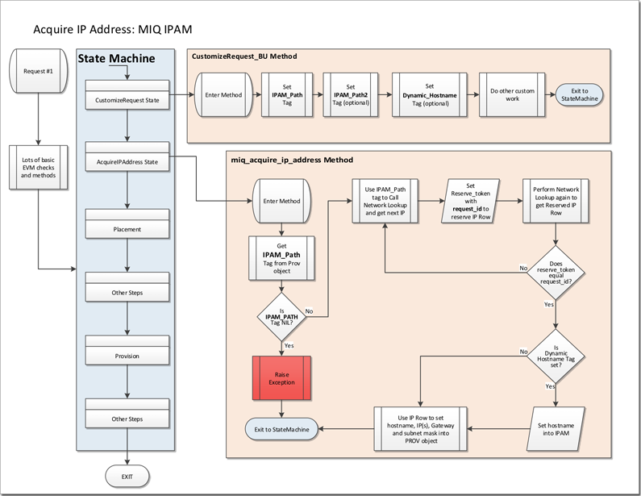

#### Files and Structure

The basic working of the MIQ IPAM system has 3 possible methods and contains N number of networks.  The structure 
will look similar to the following.  The 2 main methods are the miq_acquire_ip_address and miq_release_ip_address 
and perform as their names describe.  

The optional release_ip_address_router is for environments that have a hybrid IPAM system to include manually 
assigned, MIQ IPAM and a commercial IPAM system (EG: BlueCat Proteus).   The following image provides a basic 
overview of the IPAM data structure.

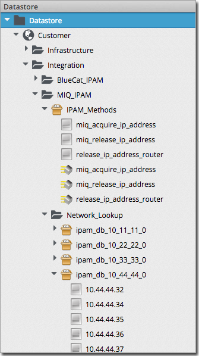

#### Basic IP Release 

The following image is a logical view of the process for the release of an IP address in a hybrid IPAM environment. 
The release IP Address Router method will route a request to the proper IPAM for release of the IP to the proper 
BlueCat Proteus instance or to the Internal MIQ IPAM system. Within the MIQ IPAM release method, a code check is 
performed looking for the IPAM_Path tag. If not found, we assume the request was a manually assigned IP and no 
further action is required.  These settings are discuss in greater detail further below.
[View PDF](images/MIQ_IPAM_Workflow.pdf)

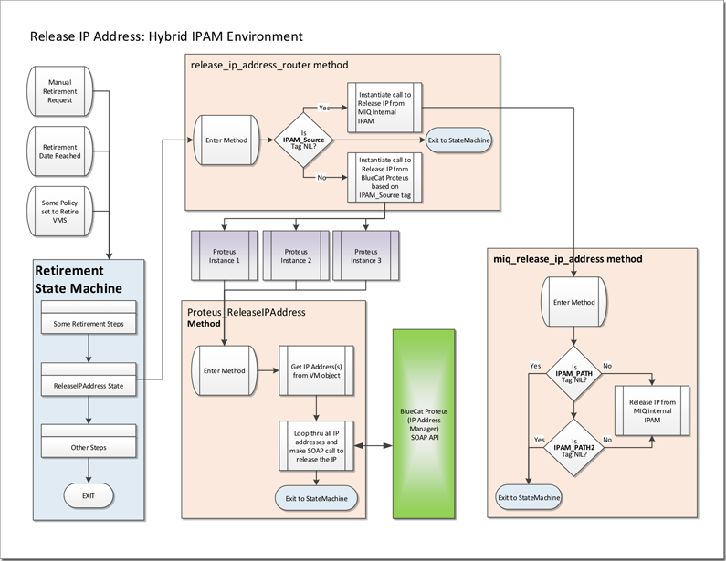

## Setup of Tags, Files and Configuration

#### Set the tags in CustomizeRequest Method

Most Business Unit spectific settings for a workflow are coded in CustomizeRequest method.

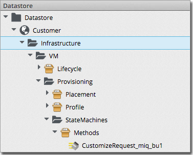

There are 2 tag categories that are required; **ipam_path** and **dynamic_hostname**.  The ipam_path tag defines the IPAM 
table to use to request an IP (EG:  ipam_path = ipam_db_10_11_11_0). This tag is set in the CustomizeRequest method but 
is used in both the acquire and release of IP addresses.
 
 _ * Warning - setting the ipam_path value with a tag that doesn't exist will fail gracefully in the CustomizeRequest 
 method.  But will cause a hard failure when not found by the miq_acquire_ip_address method _

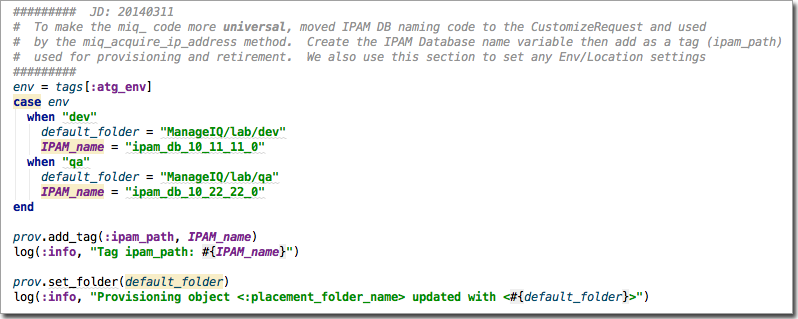

The  dynamic_hostname tag is a boolean value 
indicating whether to use the hostname value from the IPAM table or to set the hostname in the IPAM table with the 
user provided value.

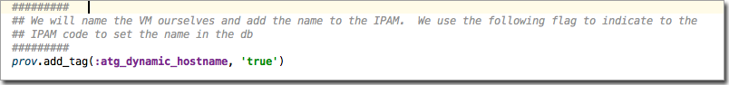

#### Setting up the Network_Lookup directory

The directory structure will look something similar to the image below but with IPAM DB names that align with 
your business requirements.

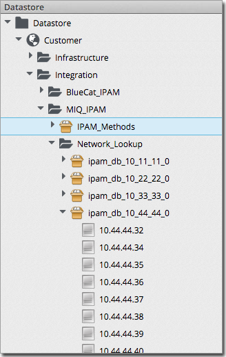

#### IPAM DB Instance 

The follow example includes the setup for using dual NICs: one for front-end access and a second for storage or 
other purposes.  This example also show an IP that has been assigned as denoted by the 'inuse' flag.

This is an example that is available for use and it uses a single NIC

Set up the Provision State machine with something similar to the following

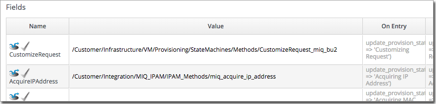

#### Setup Retirement

The IPAM release code uses the standard VM Retirement state machine.  

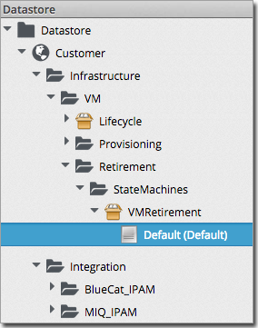

Set up the Provision State machine with something similar to the following.  Depending on your environment, you 
can call one of the two different release methods.  If you are in a hybrid environment where there is manual, MIQ 
internal IPAM and a commercial  IPAM solutions, then use the release_ip_address_router method.  

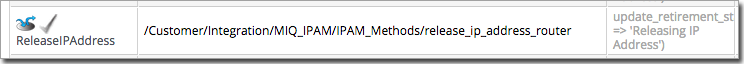
 
The release_ip_address_router uses the following code to direct retirement traffic to the correct method to 
actually perform the release of the IP.  It may be necessary to update to the proper directory structure.

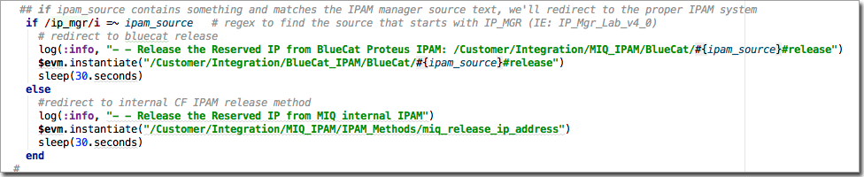

If you only use the internal MIQ IPAM, something similar to the following will be set in the retirement state machine.

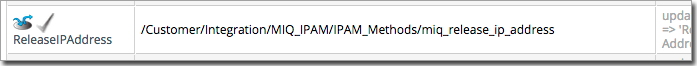

## Command Line Scripts

#### CSV file to Zipped YAML

The miq_ipam_csv2zipyaml.rb file is a ruby shell script to convert a comma separated values (CSV) file into a properly 
formatted automate zipped file.  Below are two examples of common CSV file structures.  The first example includes 
columns for support of 2 NICs.  The order of the columns is not important as much as certain columns must exist.  
The columns of inuse, vlan, ipaddr, gateway, submask and reserve_token are required and will cause the script to fail 
if not found.  The columns will define the schema for the IPAM instances.

This example shows how to configure for use with dual NIC.  Since the second NIC is a subnetted as a /24 network, the 
subnet mask 2 (submask2) can be left blank.  If subnetted differently, the add the appropriate  subnet mask setting.

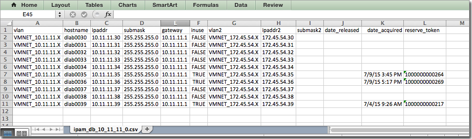

This example has only 1 NIC and note how some IP rows have already been reserved.

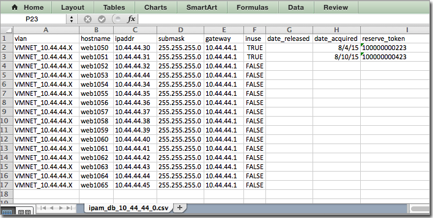

Prior to running the miq_ipam_csv2zipyaml.rb script, it may be necessary to update the script to match your 
directory structure.  Updating the directory array as shown below can change the directory structure.  

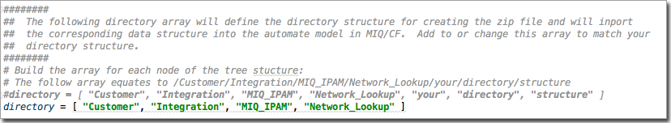

Below is an example of running the script on MacOS locally.  Initiate the script as "ruby ipam_csv2zipyaml.rb" and 
the script should run interactively asking for input and output file names.  

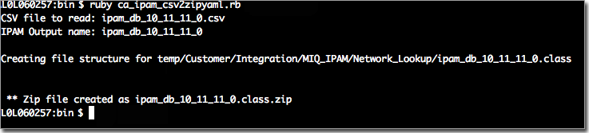

Once the zip file has been created, import it into ManageIQ via the web import by selecting Automate=>Import/Export.  
Choose the zip file and upload.

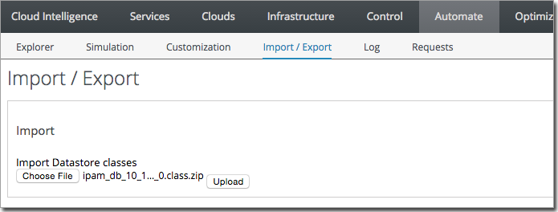

**TODO:**
	_Still need to create a ipam_zip2csv.rb file that will take an automate zip file and convert yaml 
	files into a single CSV file._ 

#### Automate XML Scripts

If you are running an older version of MIQ/CLoudForms which uses the automate XML files, then you can use the 
following 2 scripts.  The **miq_ipam_xml2csv.rb** script will convert a properly formatted automate XML file into a CSV 
file.  The automate XML file can only include the XML for the specific IPAM class.  It will not parse the file 
if it is a complete automate model file.

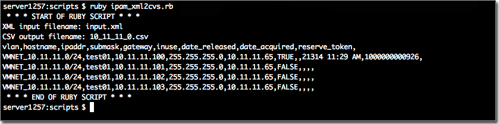

The converted output file will be a CSV and will look similar to the following.

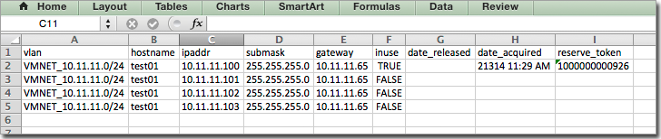

The *miq_ipam_csv2xml.rb* file will take the edited CSV spreadsheet and convert it into a properly formatted 
automate XML file.  This can imported into ManageIQ via the web import by selecting Automate=>Import/Export. 
Choose the zip file and upload.

