This is an automation library for operating OpenStack clouds in MiQ.

## Installation

* Run "rake" in the "scripts" directory to create the OpenStackOps zip file.

```
[msolberg@lappy manageiq_depot]$ cd openstack_ops/scripts/
[msolberg@lappy scripts]$ rake
Removing old zip file.
Building zip file.
[msolberg@lappy scripts]$ ls
OpenStackOps  OpenStackOps.zip  Rakefile
```

* Import the zip file into Automate via the "Import/Export" menu item.
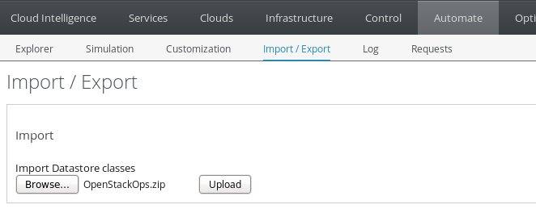
* Once the library is imported successfully, you'll need to enable it in the Automate Explorer.
  * Navigate to the Explorer and select the OpenStackOps Domain.
  * Select "Edit this Domain" from the "Configuration" Dropdown.
  * Check the "Enabled" control on the "Info" panel and click "Save".


## Usage

The library consists of the following components:

**/OpenStackOps/OpenStack/Methods**:  This is a set of methods which operate on OpenStack instances.  The following methods are implemented:

* **ConvertMetadataToTags**: Converts Nova Metadata to ManageIQ tags.
* **ListMigrationTargets**: Retrieve a list of possible migration targets for a virtual instance.  (For use in generating dynamic drop down lists)
* **MigrateInstance**: Live Migrate an Instance to the hypervisor specified in dialog_TargetHypervisor
* **RebuildInstance**: Rebuild an Instance from its original image.
* **TagHypervisor**: Update the instance tags with the hypervisor.
* **VerifyMetadata**: Example method which verifies that a particular metadata tag exists.

**/OpenStackOps/System/Event**: The following Events are defined in the library:

* **compute.instance.live_migration._rollback.end**: Reruns OpenStackDiscovery after live migration events.
* **compute.instance.live_migration.post.dest.end**: Reruns OpenStackDiscovery after live migration events.
* **compute.instance.rebuild.end**: Reruns OpenStackDiscovery after rebuild events.
* **OpenStackDiscovery**: Runs the ConvertMetadataToTags and TagHypervisor methods on OpenStackDiscovery Requests.

**/OpenStackOps/System/Request**: The following Requests are defined in the library:

* **MigrateInstance**: Initiates a live migration of an instance.
* **OpenStackDiscovery**: Used to run tagging operations on new instances.
* **RebuildInstance**: Initiates a rebuild of an instance.

The Request instances can be triggered from a button attached to
the "VM and Instance" objects.  To create these buttons:

* Navigate to "Automate": "Customization".
* Select the "Buttons" menu on the left hand navigation.
* Select "VM and Instance".
* Choose "Add a new Button Group" from the "Configuration" dropdown.
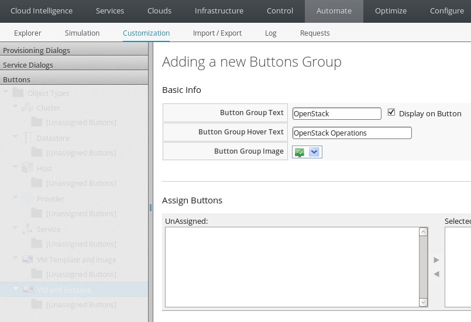
* Give the Button Group a name, hover text, and an image.
* Create the group by clicking the "Add" button in the lower right.
* Select the "OpenStack" button group on the left hand navigation.
* Select "Add a new Button" from the "Configuration" dropdown.
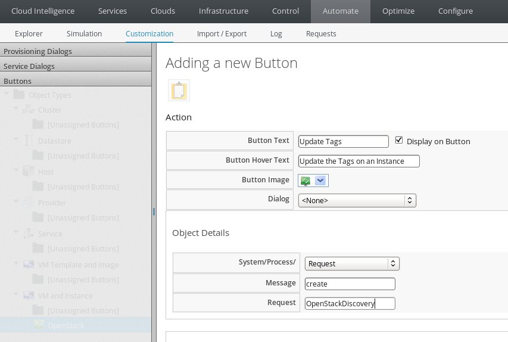
* Give the button text, hover text, and an image.
* Select "Request" from the System/Process drop down
* Enter the name of the Request in the Request box.
* If required, specify a dialog.  Instructions on importing service dialogs are below.
* Create the button by clicking the "Add" button in the lower right.

To import Service Dialogs:

* Navigate to "Automate": "Customization".
* Select the "Import/Export" menu on the left hand navigation.
* Select "Service Dialog Import/Export".
* Browse to the dialog YAML file from the "dialogs" directory under "openstack_ops".
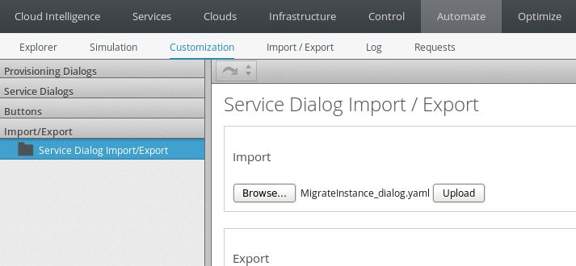
* Select "Upload".
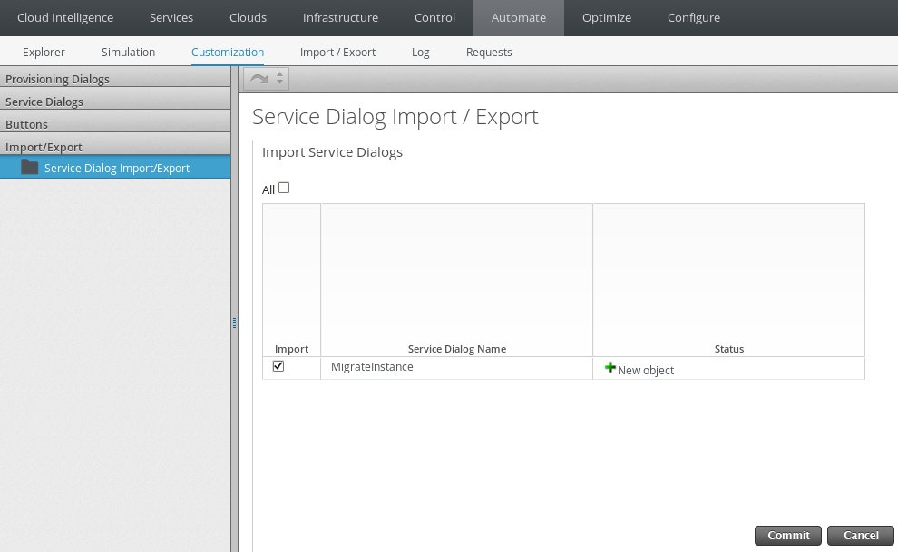
* Select "Commit" to finish importing the dialog.

To re-link dynamic drop down menus for the dialog:

* Navigate to "Automate": "Customization".
* Select "Service Dialogs" from the left hand navigation.
* Select the dialog box from the navigation.
* Select "Edit this Dialog" from the "Configuration" menu.
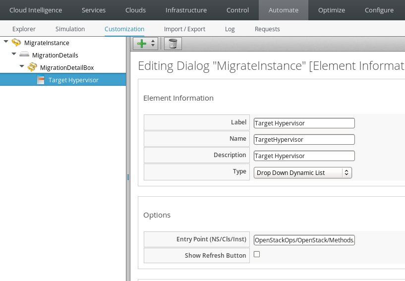
* Select the element containing the drop down list.
* Specify the appropriate instance under "Options".
* Click "Save" to save the changes.

The Requests in this library can also be called from Control Policies.  To initiate a Request from a Control Policy:

* Navigate to "Control": "Explorer".
* Select "Actions" from the left hand navigation.
* Select "Add a new Action" from the "Configuration" menu.
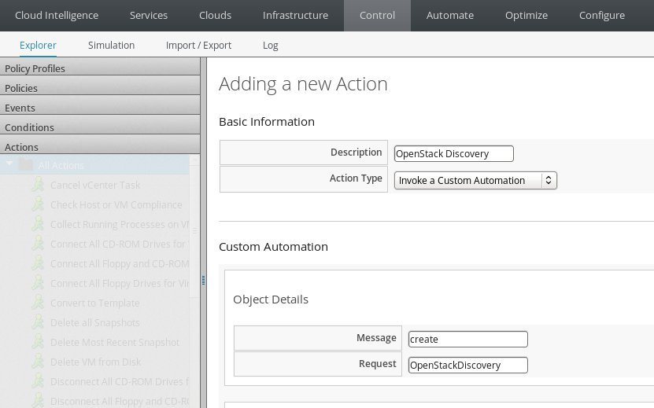
* Provide a Description and select "Invoke a Custom Automation" from the "Action Type" drop down list.
* Enter "create" for the "Starting Message" and the name of the Request in the "Request" field.
* Click "Add" to add the new action.
* Select "Policies" from the left hand navigation.
* Select "Vm Control Policies" from the left hand navigation.
* Select "Add a new Vm Control Policy from the "Configuration" menu.
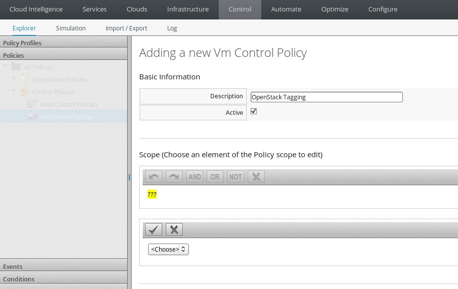
* Provide a description for the Policy and click "Add" to create the policy.
* Select "Edit this Policy's Event assignments" from the "Configuration" menu.
* Select any events you want to trigger the Request.
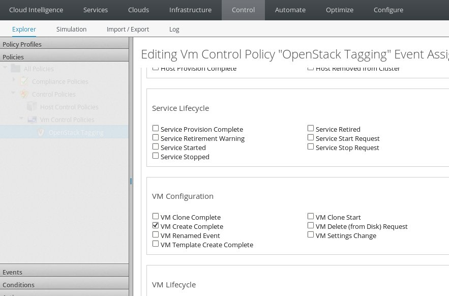
* Select the event in the left hand navigation and select "Edit Actions for this Policy Event" from the "Configuration" menu.
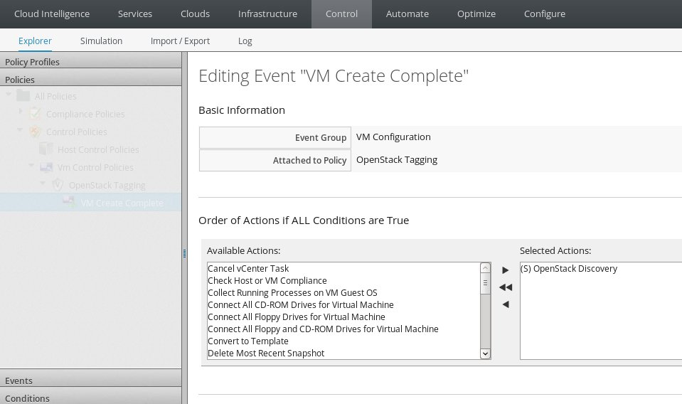
* Select Actions from the "Available Actions" control.
* Click "Save" to add the actions to the event.
* Select "Policy Profiles" from the left hand navigation.
* Select "Add a new Policy Profile" from the "Configuration" drop down.
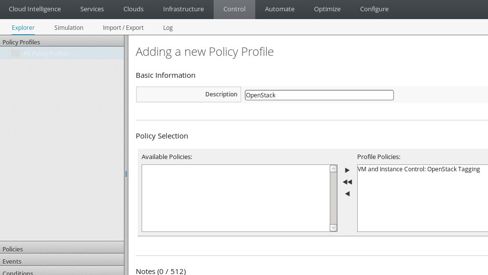
* Provide a description for the profile and select policies from the "Available Policies" drop down.
* Click "Add" to create the policy profile.
* This profile can then be applied to OpenStack cloud providers.

