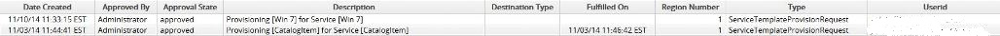
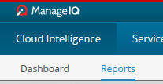
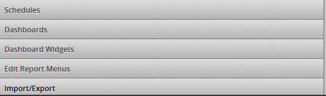
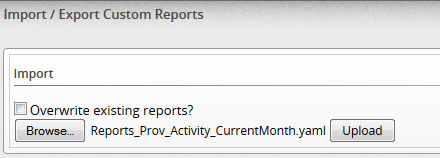

This is a package of 5 reports that you can use for provisioning activity over the current month, quarter, 
YTD, Previous month and Quarter.

The reports contain the following fields:
-Date Created 
-Approved By
-Approval State
-Description
-Destination Type
-Fulfilled On
-Region Number
-Type
-Userid

To add the reports to your MIQ or CloudForms environment go to Cloud Intelligence and then Reports

Select Import/Export at the bottom left navigation.

Download the report yaml definitions for the reports you want to import.

Download the [current month report here](scripts/Reports_Prov_Activity_CurrentMonth.yaml)
Download the [current quarter report here](scripts/Reports_Prov_Activity_CurrentQuarter.yaml)
Download the [previous month report here](scripts/Reports_Prov_Activity_PreviousMonth.yaml)
Download the [previous quarter report here](scripts/Reports_Prov_Activity_PreviousQuarter.yaml)
Download the [year to date report here](scripts/Reports_Prov_Activity_YTD.yaml)

Browse to the report yaml file that you want to upload.

